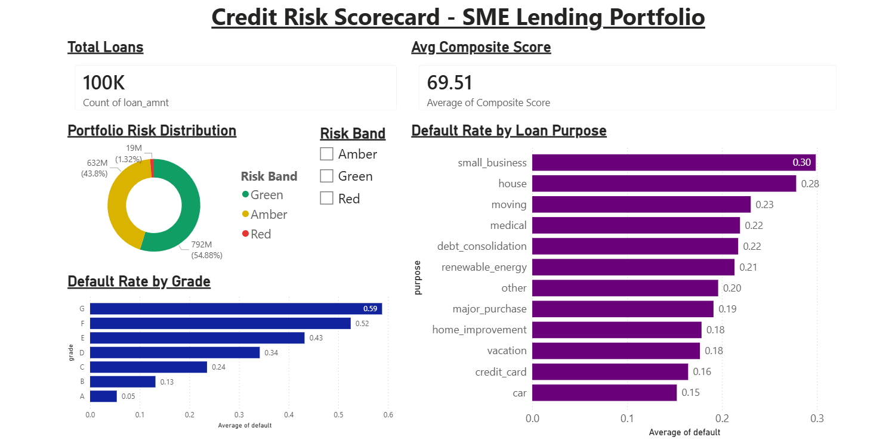

# Credit Risk Scorecard & Portfolio Monitoring Dashboard 💳

## Project Overview
An end-to-end credit risk scorecard built on 100,000 real loan records from the 
Lending Club dataset. The project replicates the kind of credit risk analysis 
performed by analysts in retail banking and fintech — from raw data ingestion and 
cleaning through to an interactive executive dashboard.

The core question this project answers: **which borrowers are most likely to 
default, and how do we score and segment them systematically?**

## Tools Used
- **Microsoft Excel** — data modelling, scoring logic, weighted composite scores
- **Power Query** — data ingestion, cleaning, and transformation of 100,000 records
- **Power BI** — interactive portfolio monitoring dashboard
- **Dataset** — Lending Club Loan Dataset (Kaggle, 100,000 records)

## The Methodology

### Step 1: Data Cleaning & Preparation
Raw CSV data was ingested using Power Query, filtered to relevant fields, and 
cleaned to resolve data type inconsistencies across 100,000 records. Only 
fully paid and charged off loans were retained to create a clean binary 
default classification.

### Step 2: Default Flag
A binary Default column was engineered:
- 1 = Charged Off (defaulted)
- 0 = Fully Paid

### Step 3: Credit Scorecard Design
Each borrower was scored across four risk dimensions:

| Factor | Weight | Logic |
|---|---|---|
| Loan Grade | 40% | A = 100 pts down to G = 5 pts |
| Debt-to-Income Ratio | 25% | Lower DTI = higher score |
| Annual Income | 20% | Higher income = higher score |
| Employment Stability | 15% | Longer employment = higher score |

### Step 4: Composite Score & Risk Bands
A weighted composite score was calculated per borrower and classified into:
- 🟢 **Green** — Low Risk (score 70+)
- 🟡 **Amber** — Medium Risk (score 40–69)
- 🔴 **Red** — High Risk (score below 40)

## Key Findings
- 📌 Grade A borrowers defaulted at just **5.38%** vs **58.81%** for Grade G
- 📌 Small business loans carried the highest default rate at **30%**
- 📌 Car loans were the safest loan purpose at **15%** default rate
- 📌 Portfolio average composite score: **69.51** (medium-low risk overall)
- 📌 **54.88%** of borrowers classified as Green, **43.80%** Amber, **1.32%** Red

## Dashboard Features
- Portfolio Risk Distribution (Green / Amber / Red donut chart)
- Default Rate by Grade — staircase pattern from 5% to 59%
- Default Rate by Loan Purpose — ranking all loan types by risk
- Average Composite Score KPI card
- Total Loans KPI card
- Interactive Risk Band slicer

## Dashboard Preview

## What This Project Demonstrates
- End-to-end analytical thinking from raw data to business insight
- Credit risk methodology and scorecard design used in real banking
- Advanced Excel modelling with weighted scoring logic
- Power Query data transformation at scale (100,000 records)
- Power BI dashboard development for executive-level reporting

## Author
**Tumi Phororo**  
Junior Data Analyst | BSc Information Technology  
[LinkedIn](https://linkedin.com/in/tumi-phororo-587640271) | calvinphororo@gmail.com
